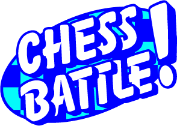

<p align="center">
  
</p>

# Chess Battle - Python Chess Game

Chess Battle is a Pythonic chess game board that allows you to play chess against a friend, a neighbour, a CFG classmate, a crush from Tinder, or a sibling, I guess you get the point by now.
It provides a graphical user interface for a chessboard, complete with goofy and fun chess piece graphics.
This README will guide you through the project, its setup, and usage.

## Table of Contents

1. [How to Install and Run the Project](#how-to-install-and-run-the-project)
2. [How to Run the Test Suites](#how-to-run-the-test-suites)
3. [How to Use the Project](#how-to-use-the-project)
4. [Project Structure](#project-structure)
5. [Credits](#credits)
6. [License](#license)

## How to Install and Run the Project

To run Chess Battle on your local machine, follow these steps:

1. Clone the repository to your local machine:

   ```bash
   git clone https://github.com/your-username/chess-battle.git
   ```

2. Navigate to the project directory:

   ```bash
   cd chess-battle
   ```

3. Install the required Python dependencies using Pipenv. If you don't have Pipenv installed, you can install it with pip:

   ```bash
   pip install pipenv
   ```

4. Install the project dependencies using Pipenv:

   ```bash
   pipenv install
   ```

5. Activate the virtual environment:

   ```bash
   pipenv shell
   ```

6. Run the game by executing the `menu.py` file:

   ```bash
   python menu.py
   ```

7. Enjoy playing Chess Battle!

## How to run the test suites

```bash
 python run_tests.py
```


## How to Use the Project

Chess Battle provides a user-friendly interface for playing chess. Here's how to use it:

- **Main Menu**: When you start the game, you'll be greeted with a main menu that offers the following options:

  > **_NOTE:_** For users with smaller screens (under 16 inches), here's a tip to enhance your experience: Hold down the Shift key while dragging the corner of your screen inward to resize it while maintaining the aspect ratio.

  - **Play Chess**: Start a new game of chess.
  - **Games History**: View a history of previous games.
  - **Quit**: Exit the game.

- **Playing Chess**:

  - Click on a chess piece to select it. Valid moves for the selected piece will be highlighted.
  - Click on a highlighted square to move the selected piece there.
  - Special moves like castling are supported!!.
  - Pawn promotion occurs when a pawn reaches the opposite end of the board. Also supported.
  - The game keeps track of check and checkmate conditions (of course).

- **Game History**: You can view a history of previous games, including the moves made in each game. Say Whaaaaaaaat?!. All the movements are being recorded on the moves.json file for you.

- **Winning Screen**: After a game ends, a winning screen will appear, allowing you to replay, return to the main menu, or quit the game.

## Project Structure

The project is structured as follows:

- `menu.py`: The main entry point for the game, including the main menu and game setup.
- `game.py`: Handles the game logic, including move validation and checkmate detection.
- `models/`: Contains classes for chess pieces, the chessboard, and other game-related functionality.
- `assets/`: Includes images and fonts used in the game.
- `tests/`: Contains unit tests for various game components.

## Credits

This project was developed by Hannah Killoh, Heather Watson, and Sandra Molina Palencia as part of Code First Girl Summer Degree.

## License

This project is licensed under the MIT License License - see the [LICENSE](LICENSE) file for details.
